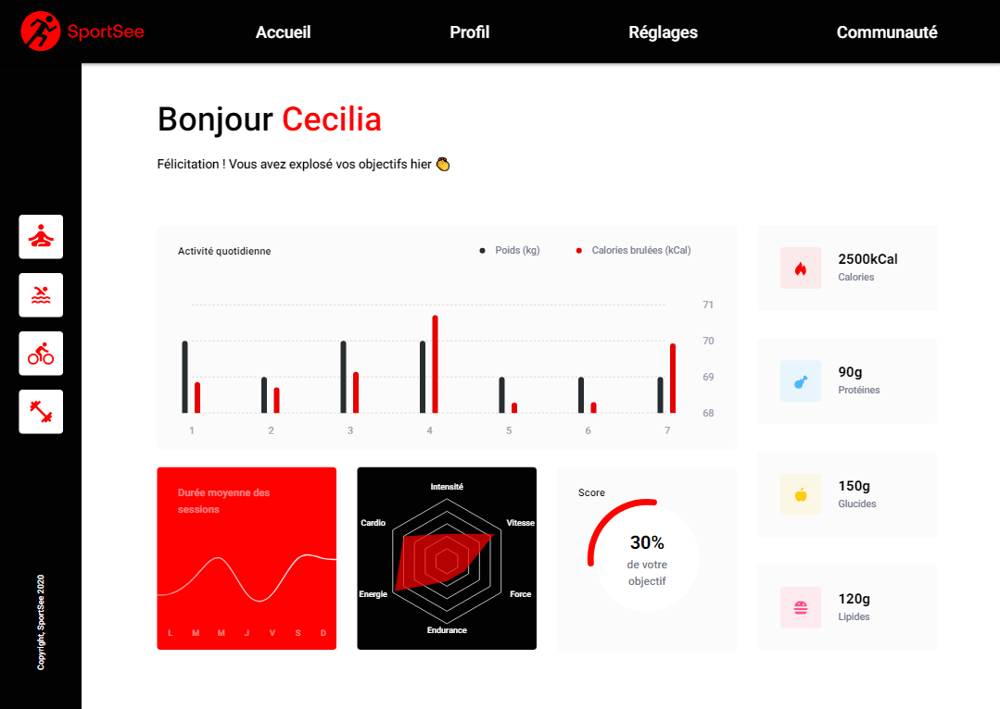
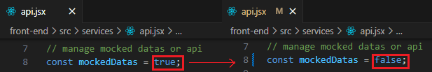

# SportSee

## Développez un tableau de bord d'analytics avec React

### 📚 Présentation

Ce projet a pour objectif le développement d'un tableau de bord d'analytique de coaching sportif.  
Il vise à intégrer des graphiques et des diagrammes en utilisant React et à récupérer des données via une API.  
Pour le moment, il se concentre sur le tableau de bord de l'utilisateur.  
Il existe actuellement une simulation d'authentification pour récupérer le statut (authentifié ou non) et l'identifiant de l'utilisateur.  
Ces informations sont stockées dans un contexte, afin d'y accéder depuis n'importe quelle page, et éventuellement gérer la sécurité des données en autorisant l'accès à certains éléments en fonction du statut.  
Cela permet également d'empêcher l'accès à une page avec un identifiant qui n'est pas celui de l'utilisateur connecté. 
Les données peuvent être simulées ou provenir d'une API, elles sont formatées pour permettre le remplissage des graphiques.

### 💡 Outils et technos

### 🔨 Installation du projet

Le projet utilise NodeJS et `pnpm` 

➡ Télécharger le dossier du code et le dézipper 
➡ Ouvrir le dossier dans VSCode (ou tout autre IDE) 
➡ Installer les nodes-modules : `pnpm install` 

### 🚀 Lancement du projet

➡ Lancer l'API :  
[Repository de l'API](https://github.com/OpenClassrooms-Student-Center/P9-front-end-dashboard) 
Suivre les instructions du README lié à l'API. 

➡ Lancer l'application : `pnpm run dev` 

Par défaut, le programme utilise des données simulées. 
Pour modifier cela, il suffit d'aller dans le fichier services/api.jsx et de modifier la ligne 8 :  

### ⚙ Contraintes techniques

➡ Pour les graphiques : D3 ou recharts 
➡ Intégration Desktop - écrans d’au moins 1024 par 780 pixels (responsive non obligatoire) 
➡ Réalisation des calls API en dehors des composants 
➡ Utilisation de données mockées pour commencer 
➡ Standardisation des données venant de l’API 
➡ Récupération des services auprès d’une API externe, les formater et les envoyer à une librairie de composants 

### 🏆 Compétences évaluées

➡ Assurer la qualité des données d'une application 
➡ Développer des éléments graphiques avancés à l'aide de bibliothèques JavaScript 
➡ Interagir avec un service Web 
